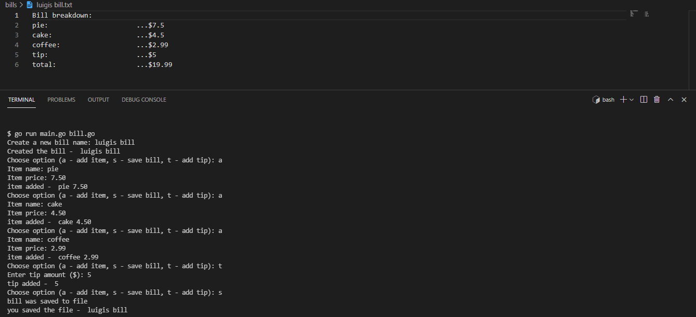

# Billing CLI - Go Projects

A bill calculator using the command-line interface to understand Go basics.

        

## Features

- learning about types: strings, integers, floats and maps.
- printing and formatting strings.
- defining arrays and slices.
- importing packages from the standard library.
- using loops, booleans and conditionals.
- creating functions and returning multiple values.
- understanding non-pointer values and pointer wrapper values.
- making custom data types with structs and interfaces.
- structuring our code with receiver functions and pointers.
- handling user input and errors with switch statements.
- saving the formatted bill to a text file.

Based on [Go Tutorial (Golang) for Beginners](https://www.youtube.com/watch?v=etSN4X_fCnM&list=PL4cUxeGkcC9gC88BEo9czgyS72A3doDeM) by Shaun Pelling - The Net Ninja (2021).
